# Introduction

This project is an example of authentication and authorization with [React library](https://reactjs.org/) and [Auth0 Service Provider](https://auth0.com/).

## Authentication

In this project the authentication process is implemented using [OpenID Connect](https://openid.net/connect/).
It is an interoperable authentication protocol based on the OAuth 2.0 family of specifications. You can find more information about it in [Nat Sakimura, Chairman of OpenID Foundation](https://youtu.be/Kb56GzQ2pSk).

## Authorization

In this project the authorization process is implemented using [OAuth2.0](https://oauth.net/2/).
OAuth 2.0 is the industry-standard protocol for authorization. OAuth 2.0 focuses on client developer simplicity while providing specific authorization flows for web applications, desktop applications, mobile phones, and living room devices.You can find more information about it in [What's New With OAuth and OIDC?](https://youtu.be/g_aVPdwBTfw).

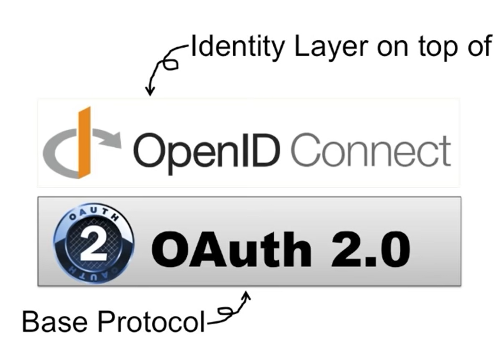

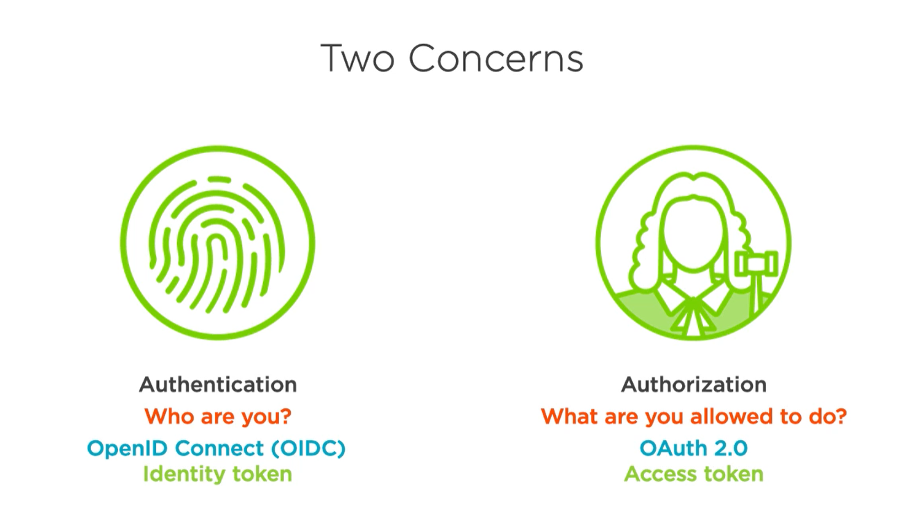

## Auth0

Auth0 is a authentication and authorization service provider, it has integration with many other services (Google, Facebook, Linkedin).

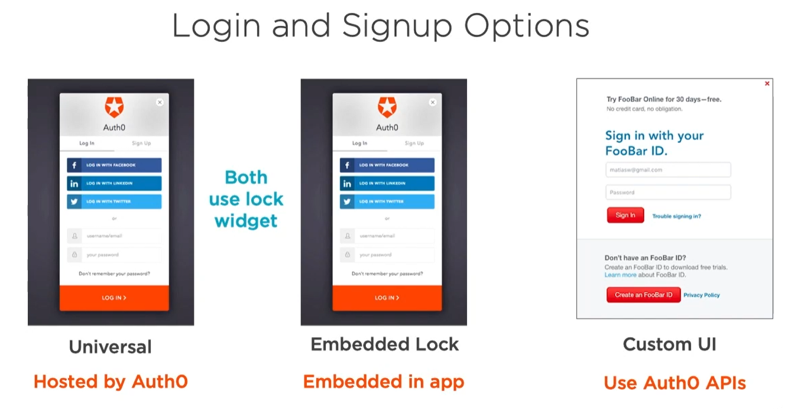

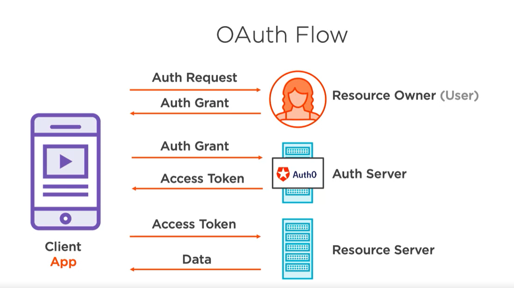

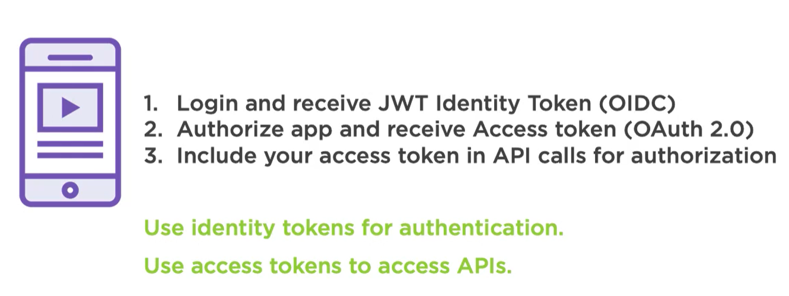

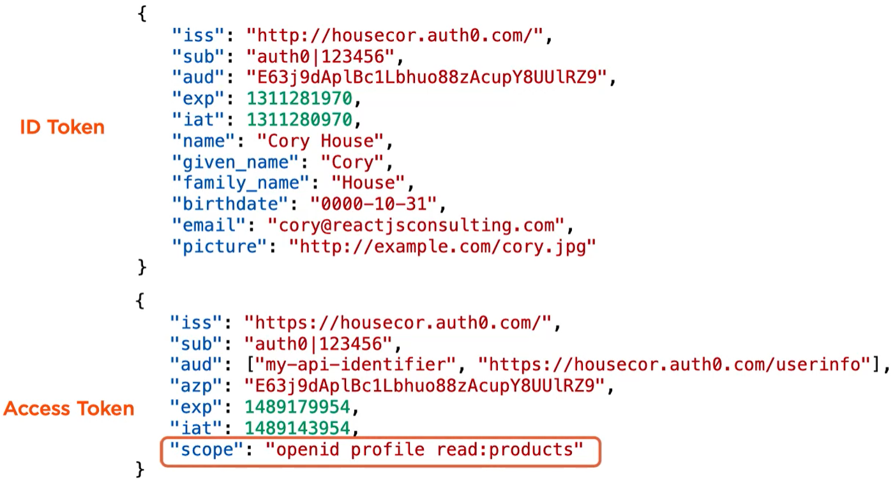   

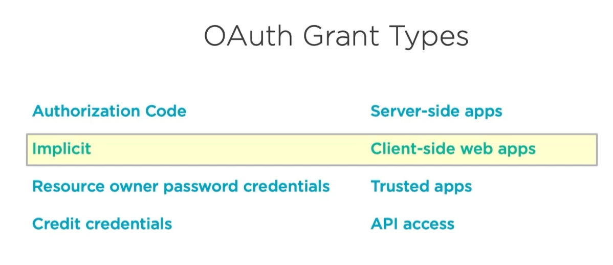

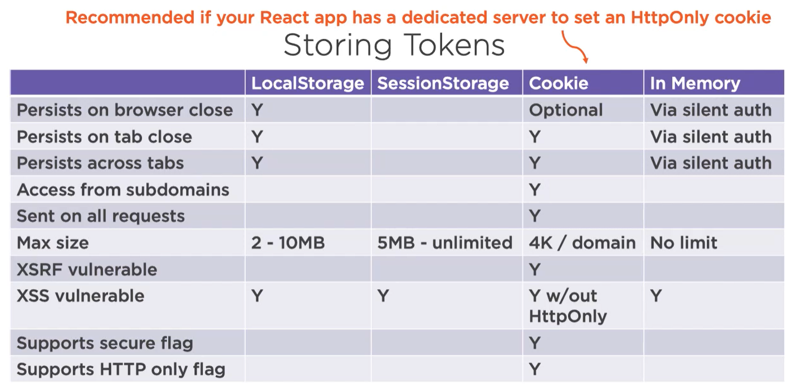

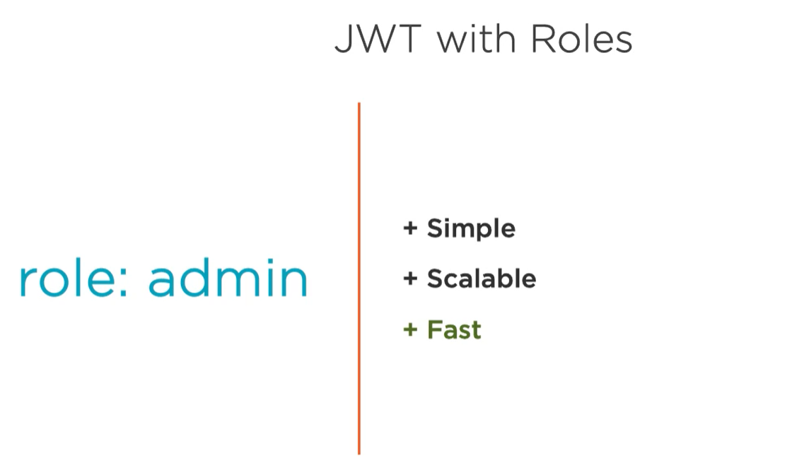

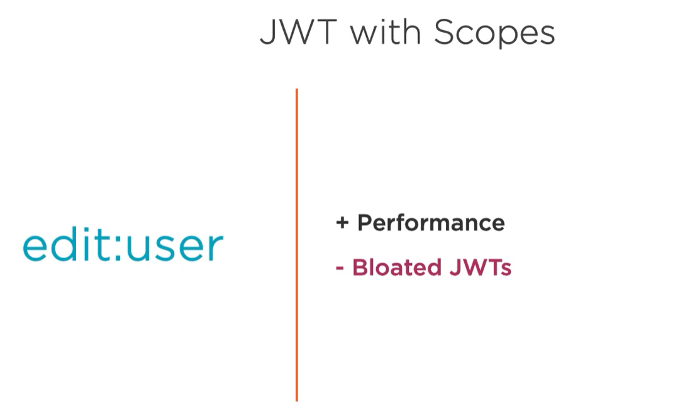

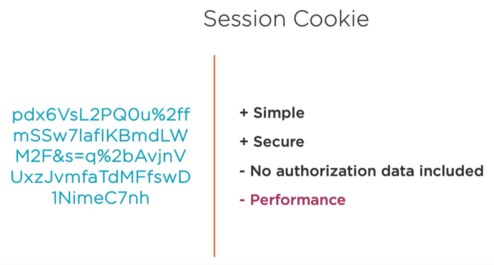

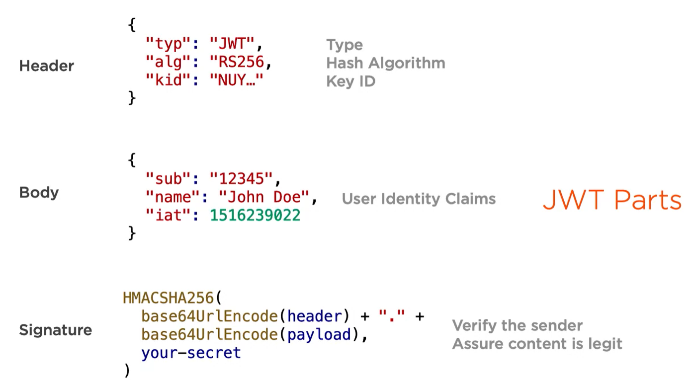

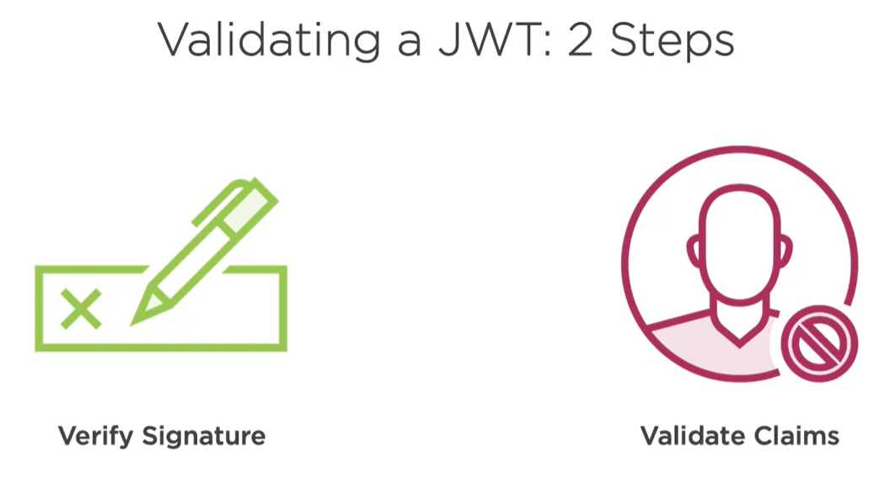

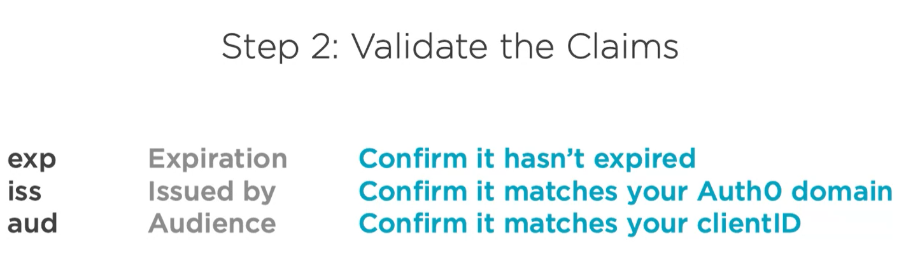

## Run project:

1. Add Auth0 credentials to .env file:

```
REACT_APP_AUTH0_DOMAIN=ADD AUTH0 DOMAIN
REACT_APP_AUTH0_CLIENT_ID=ADD AUTH0 API CLIENT ID
```

2. Run the following:

```
npm i
npm start
```